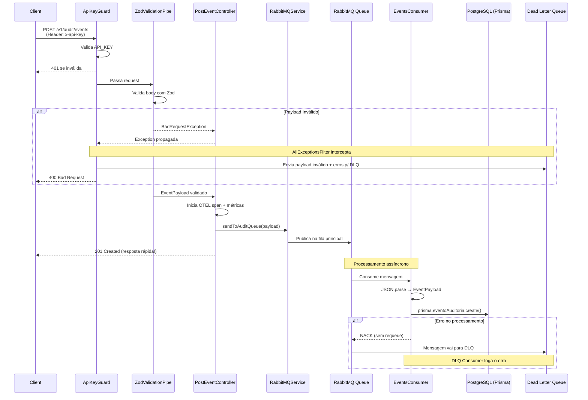
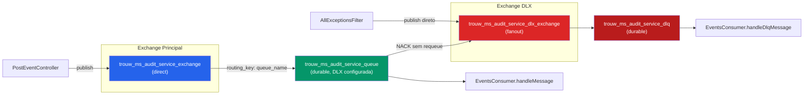
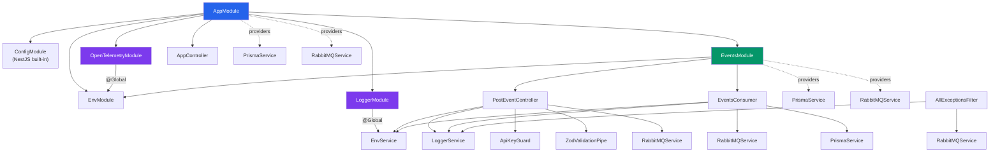
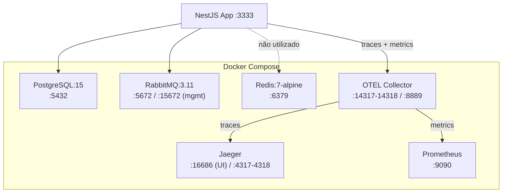

# 🔍 Deep Dive — Events Service (Audit Service)

> Documentação completa do projeto `events-service`, analisando arquitetura, padrões de código, fluxo de dados e pontos de melhoria para a futura migração para arquitetura hexagonal.

---

## 1. Visão Geral e Contexto de Negócio

O **Audit Service** (ou Serviço de Eventos) serve como um sistema centralizado de auditoria para a plataforma, permitindo armazenar eventos emitidos por outros serviços ou pelo _client-side_ para visualização e acompanhamento posterior.

> **💡 Inspiração:** O design da solução teve como forte base a simplicidade de uso de ferramentas consolidadas de mercado, como o **Mixpanel**.

### 1.1 Fluxo de Operação Otimizado

Para garantir alta disponibilidade e não travar o _client-side_ esperando operações custosas no banco de dados, o fluxo foi desenhado de forma assíncrona:

1. **Recepção:** O serviço recebe o payload do evento via requisição HTTP (JSON), protegida por API Key.
2. **Validação:** Validação estrita do payload com Zod.
3. **Resposta Rápida (Fast Response):** O evento é publicado numa fila RabbitMQ imediatamente, garantindo uma resposta rápida (`201 Created`) ao client.
4. **Persistência Assíncrona:** Um _consumer_ escuta a fila em background e grava o evento consolidado no banco de dados PostgreSQL via Prisma.
5. **Tratamento de Falhas:** Erros de validação ou de processamento desviam o fluxo para uma _Dead Letter Queue_ (DLQ).

O fluxo completo está implementado, funcional e em transição para a Arquitetura Hexagonal.

---

## 2. Stack Tecnológica

| Camada               | Tecnologia                 | Versão                                      |
| -------------------- | -------------------------- | ------------------------------------------- |
| **Runtime**          | Node.js                    | 22.20                                       |
| **Framework**        | NestJS                     | ^11.0.1                                     |
| **Linguagem**        | TypeScript                 | ^5.7.3                                      |
| **ORM**              | Prisma                     | ^6.16.3                                     |
| **Banco de Dados**   | PostgreSQL                 | 15 (Docker)                                 |
| **Message Broker**   | RabbitMQ (amqplib)         | ^0.10.9                                     |
| **Cache**            | Redis                      | 7-alpine (Docker) — não utilizado no código |
| **Validação**        | Zod                        | ^4.1.12                                     |
| **Documentação API** | Swagger (NestJS)           | ^11.2.0                                     |
| **Logging**          | Winston + Daily Rotate     | ^3.18.3                                     |
| **Observabilidade**  | OpenTelemetry SDK          | ^0.206.0                                    |
| **Tracing**          | Jaeger                     | latest                                      |
| **Métricas**         | Prometheus                 | latest                                      |
| **Collector**        | OTEL Collector Contrib     | latest                                      |
| **Testes**           | Vitest + Supertest         | ^3.2.4                                      |
| **Compilação**       | SWC (via unplugin-swc)     | ^1.13.5                                     |
| **Lint**             | ESLint (Rocketseat config) | ^9.37.0                                     |

---

## 3. Estrutura do Projeto

```
events-service/
├── .github/workflows/
│   └── deploy-stage.yml              # CI/CD: Deploy via SSH na branch stage
├── http/
│   ├── valid-test-post-event.http    # Exemplo de req HTTP válida
│   └── invalid-test-post-event.http  # Exemplo de req HTTP inválida
├── observability/config/
│   ├── otel-collector-config.yaml    # Config do OTEL Collector
│   └── prometheus-config.yaml        # Config do Prometheus
├── prisma/
│   ├── schema.prisma                 # Schema do banco de dados
│   └── migrations/
│       └── 20260219182317_init/      # Migration inicial
├── src/
│   ├── main.ts                       # Bootstrap (cria app, swagger, rabbit)
│   ├── app.module.ts                 # Módulo raiz
│   ├── app.controller.ts             # Health check endpoint
│   ├── env/
│   │   ├── env.ts                    # Schema Zod das variáveis de ambiente
│   │   ├── env.service.ts            # Serviço tipado para acessar env vars
│   │   └── env.module.ts             # Módulo do serviço de env
│   ├── filters/
│   │   └── exceptions.ts             # Filtro global (com envio p/ DLQ)
│   ├── infra/
│   │   ├── opentelemetry/
│   │   │   ├── opentelemetry.module.ts
│   │   │   └── opentelemtry.service.ts  # SDK OTEL (typo no nome)
│   │   └── rabbitmq/
│   │       ├── rabbitmq.service.ts   # 🆕 Service completo do RabbitMQ
│   │       └── setup.ts             # 🆕 Setup de exchanges/queues
│   ├── logger/
│   │   ├── logger.service.ts         # Logger custom (Winston + OTEL)
│   │   └── logger.module.ts          # Módulo global do logger
│   ├── middlewares/
│   │   └── otel-request-middleware.ts # Middleware de tracing HTTP
│   ├── pipes/
│   │   └── zod-validation-pipe.ts    # Pipe genérico de validação Zod
│   ├── test/
│   │   ├── setup-e2e.ts              # Setup E2E (schema isolado)
│   │   └── controllers/
│   │       └── post-event-controller.e2e-spec.ts
│   └── v1/
│       ├── auth/
│       │   └── api-key.guard.ts      # Guard de autenticação
│       ├── events/
│       │   ├── events.module.ts      # Módulo de eventos
│       │   ├── post-event.controller.ts  # Controller HTTP → RabbitMQ
│       │   └── events.consumer.ts    # 🆕 Consumer RabbitMQ → Prisma
│       ├── interfaces/
│       │   ├── schemas.ts            # Zod schemas
│       │   ├── types.ts              # Types inferidos do Zod
│       │   ├── enums.ts              # 🆕 Enums Severity/Result
│       │   └── dto.docs.ts           # DTOs para Swagger
│       └── prisma/
│           └── prisma.service.ts     # Serviço Prisma (conectado!)
├── docker-compose.yml
├── package.json
├── tsconfig.json
├── vitest.config.mts
└── vitest.config.e2e.mts
```

---

## 4. Fluxo de Dados Completo



---

## 5. Arquitetura de Mensageria (RabbitMQ)

### 5.1 Topologia das Filas



### 5.2 Detalhes do RabbitMQService

O [RabbitMQService](file:///wsl.localhost/Ubuntu/home/pedro/Projetos/me/events-service/src/infra/rabbitmq/rabbitmq.service.ts) é robusto e inclui:

| Feature              | Implementação                                                        |
| -------------------- | -------------------------------------------------------------------- |
| **Conexão**          | `amqplib` direto (sem wrapper NestJS/microservices)                  |
| **Setup**            | Cria exchanges (direct + fanout), queues e bindings no init          |
| **Publish**          | `sendToAuditQueue()` — persistent, mandatory                         |
| **Publish DLQ**      | `sendToDLQQueue()` — para payloads inválidos direto                  |
| **Consume**          | Callback-based com ACK/NACK automático                               |
| **Consume DLQ**      | Sempre ACK (para não travar a DLQ), com parsing de `x-death` headers |
| **Return handling**  | Listener para mensagens não-roteadas                                 |
| **Wait for channel** | Polling com retry (20x250ms) antes de consumir                       |
| **Lifecycle**        | `OnModuleInit` (connect) / `OnModuleDestroy` (close)                 |

### 5.3 Setup de Exchanges e Queues ([setup.ts](file:///wsl.localhost/Ubuntu/home/pedro/Projetos/me/events-service/src/infra/rabbitmq/setup.ts))

```
1. assertExchange(mainExchange, 'direct', durable)
2. assertExchange(dlxExchange, 'fanout', durable)
3. assertQueue(dlq, durable) → bindQueue(dlq, dlxExchange, '')
4. assertQueue(mainQueue, durable, deadLetterExchange: dlxExchange) → bindQueue(mainQueue, mainExchange, mainQueue)
```

### 5.4 Dois Caminhos para a DLQ

O sistema tem dois caminhos distintos para mensagens de erro:

1. **Payload inválido (validação Zod falhou)**: O `AllExceptionsFilter` intercepta o `BadRequestException`, e **publica diretamente na DLQ** com metadados de validação
2. **Erro no processamento (consumer falhou)**: O `EventsConsumer` faz `NACK` sem requeue, e o RabbitMQ redireciona automaticamente via DLX

---

## 6. Padrões Arquiteturais Identificados

### 6.1 Organização por Módulos NestJS

| Módulo                | Escopo    | Responsabilidade                             |
| --------------------- | --------- | -------------------------------------------- |
| `AppModule`           | Root      | Compõe tudo, registra middleware, valida env |
| `EnvModule`           | Feature   | Acesso tipado às variáveis de ambiente       |
| `LoggerModule`        | `@Global` | Logger unificado (Winston + OTEL)            |
| `OpenTelemetryModule` | `@Global` | Inicializa SDK OTEL                          |
| `EventsModule`        | Feature   | Controllers, consumer, providers de eventos  |

### 6.2 Versionamento da API

Prefixo de rota: `/v1/...`. Todo o código da v1 fica em `src/v1/`.

### 6.3 Validação com Zod (não class-validator)

> [!NOTE]
> O projeto **não usa o padrão class-validator/class-transformer do NestJS**. Em vez disso, usa **Zod** com um pipe customizado.

**Fluxo da validação:**

1. [schemas.ts](file:///wsl.localhost/Ubuntu/home/pedro/Projetos/me/events-service/src/v1/interfaces/schemas.ts) — define o schema Zod
2. [types.ts](file:///wsl.localhost/Ubuntu/home/pedro/Projetos/me/events-service/src/v1/interfaces/types.ts) — infere `EventPayload` via `z.infer<>`
3. [dto.docs.ts](file:///wsl.localhost/Ubuntu/home/pedro/Projetos/me/events-service/src/v1/interfaces/dto.docs.ts) — DTO manual para Swagger (duplicação necessária)
4. Controller usa `@UsePipes(new ZodValidationPipe(eventPayloadSchema))`

### 6.4 Autenticação por API Key

Guard simples que compara `x-api-key` header com env var `API_KEY`.

### 6.5 Configuração Tipada com Zod

- [env.ts](file:///wsl.localhost/Ubuntu/home/pedro/Projetos/me/events-service/src/env/env.ts): Schema Zod para **todas** as env vars (incluindo RabbitMQ granular)
- [env.service.ts](file:///wsl.localhost/Ubuntu/home/pedro/Projetos/me/events-service/src/env/env.service.ts): Wrapper type-safe sobre `ConfigService`
- Validação no boot com `process.exit(1)` se falhar

### 6.6 Observabilidade (OTEL + Jaeger + Prometheus)

| Componente           | Implementação                                                       |
| -------------------- | ------------------------------------------------------------------- |
| **Tracing**          | OTEL SDK → Collector → Jaeger                                       |
| **Métricas**         | Histograma de duração por handler → Collector → Prometheus          |
| **Logs**             | Winston (console + arquivo rotativo diário, 15 dias) + OTEL Log API |
| **Middleware**       | `OtelRequestMiddleware` — span por request HTTP                     |
| **Exception Filter** | Registra exceptions como span events + status ERROR                 |
| **Prisma**           | `PrismaInstrumentation` para tracing de queries                     |
| **Controller**       | Span manual + histogram para `event.process.duration`               |

### 6.7 Logger Customizado

O [LoggerService](file:///wsl.localhost/Ubuntu/home/pedro/Projetos/me/events-service/src/logger/logger.service.ts) emite para **3 destinos simultâneos**:

1. **Console** (Winston) — com enriquecimento de traceId/spanId
2. **Arquivo rotativo** (`./logs/DD-MM-YYYY-events-service.log`) — 15 dias de retenção, compactado
3. **OTEL Logs API** — SeverityNumber mapeado

### 6.8 Exception Filter com DLQ Integration

O [AllExceptionsFilter](file:///wsl.localhost/Ubuntu/home/pedro/Projetos/me/events-service/src/filters/exceptions.ts) faz mais do que logar:

- Para `BadRequestException` em `/v1/audit/events`, **envia o payload inválido para a DLQ** com:
  - `originalPayload` — o body original
  - `validationErrors` — os erros do Zod
  - `failedAt` — timestamp
  - `traceId` — para correlação

---

## 7. Modelo de Dados

### 7.1 Tabela `tb_eventos_auditoria`

| Coluna           | Tipo       | Constraint        | Descrição                          |
| ---------------- | ---------- | ----------------- | ---------------------------------- |
| `id_event`       | `Int`      | PK, autoincrement | Identificador único                |
| `ts_transaction` | `DateTime` | required          | Momento do evento (ISO 8601)       |
| `id_user`        | `Int`      | required          | ID do usuário que executou         |
| `id_company`     | `Int`      | required          | ID do cliente/empresa              |
| `tp_event`       | `String`   | required          | Tipo de evento (ex: LOGIN_SUCCESS) |
| `ip_host`        | `String`   | required          | IP de origem                       |
| `id_severity`    | `Severity` | required          | HIGH / MEDIUM / LOW                |
| `id_result`      | `Result`   | required          | SUCCESS / FAILURE                  |
| `id_correlation` | `String?`  | optional          | ID para correlacionar eventos      |
| `id_entity`      | `String?`  | optional          | ID da entidade afetada             |
| `js_detail`      | `Json?`    | optional          | Detalhes adicionais (JSON livre)   |
| `ts_created_at`  | `DateTime` | required          | Data de criação do registro        |
| `id_created_by`  | `String`   | required          | Quem inseriu                       |
| `id_updated_by`  | `String`   | required          | Quem alterou                       |

### 7.2 Índices Compostos

```
@@index([id_company, ts_transaction])  — busca por empresa + período
@@index([id_user, ts_transaction])     — busca por usuário + período
@@index([tp_event, ts_transaction])    — busca por tipo + período
```

### 7.3 Enums (alinhados API ↔ DB)

```typescript
// src/v1/interfaces/enums.ts
enum Severity {
	HIGH,
	MEDIUM,
	LOW,
}
enum Result {
	SUCCESS,
	FAILURE,
}

// prisma/schema.prisma — IGUAIS
enum Severity {
	HIGH,
	MEDIUM,
	LOW,
}
enum Result {
	SUCCESS,
	FAILURE,
}
```

> [!TIP]
> Diferente da branch anterior, os enums agora estão **alinhados em inglês** tanto na API quanto no banco. ✅

---

## 8. Mapeamento API → Consumer → DB

O consumer faz o seguinte mapeamento direto:

| Campo API (Zod) | Campo DB (Prisma) | Transformação                                 |
| --------------- | ----------------- | --------------------------------------------- |
| `timestamp`     | `ts_transaction`  | `new Date(payload.timestamp)`                 |
| `userId`        | `id_user`         | direto                                        |
| `clientId`      | `id_company`      | direto                                        |
| `eventType`     | `tp_event`        | direto                                        |
| `sourceIp`      | `ip_host`         | direto                                        |
| `criticality`   | `id_severity`     | `Severity[payload.criticality]` (enum lookup) |
| `result`        | `id_result`       | `Result[payload.result]` (enum lookup)        |
| `correlationId` | `id_correlation`  | direto                                        |
| `entityId`      | `id_entity`       | direto                                        |
| `details`       | `js_detail`       | direto (JSON)                                 |
| —               | `ts_created_at`   | `new Date()`                                  |
| —               | `created_by`      | hardcoded: `'events-service'`                 |
| —               | `updated_by`      | hardcoded: `'events-service'`                 |

---

## 9. Mapa de Dependências entre Módulos



---

## 10. Infraestrutura Docker



---

## 11. Variáveis de Ambiente

| Variável                 | Tipo   | Default | Uso                           |
| ------------------------ | ------ | ------- | ----------------------------- |
| `PORT`                   | number | 3333    | Porta HTTP                    |
| `API_KEY`                | string | —       | Autenticação header           |
| `DATABASE_URL`           | url    | —       | Conexão PostgreSQL            |
| `REDIS_URL`              | url    | —       | Conexão Redis (não utilizado) |
| `RABBITMQ_HOST`          | string | —       | Host do RabbitMQ              |
| `RABBITMQ_PORT`          | string | —       | Porta do RabbitMQ             |
| `RABBITMQ_USER`          | string | —       | Usuário RabbitMQ              |
| `RABBITMQ_PASS`          | string | —       | Senha RabbitMQ                |
| `RABBITMQ_VHOST`         | string | —       | VHost RabbitMQ                |
| `RABBITMQ_MAIN_EXCHANGE` | string | —       | Nome da exchange principal    |
| `RABBITMQ_MAIN_QUEUE`    | string | —       | Nome da fila principal        |
| `RABBITMQ_DLX_EXCHANGE`  | string | —       | Nome da exchange DLX          |
| `RABBITMQ_DLQ_QUEUE`     | string | —       | Nome da fila DLQ              |
| `OTEL_SERVICE_NAME`      | string | —       | Nome do serviço no OTEL       |
| `OTEL_SERVICE_VERSION`   | string | —       | Versão do serviço no OTEL     |
| `OTEL_OTLP_*_URL`        | url    | —       | Endpoints do collector        |
| `LOG_LEVEL`              | enum   | info    | Nível de log                  |

> [!WARNING]
> O `.env.example` está **desatualizado**: ainda usa `RABBITMQ_URL` ao invés das variáveis granulares (`RABBITMQ_HOST`, `RABBITMQ_PORT`, etc.) que o código real espera.

---

## 12. Padrões de Código

### 12.1 TypeScript

- **Module system**: `nodenext` (ESM moderno)
- **Target**: ES2023
- **Path aliases**: `@/*` → `./src/*`
- **Strict mode**: Habilitado (exceto `noImplicitAny`, `strictBindCallApply`)

### 12.2 Convenções de Nomenclatura

- Arquivos: `kebab-case` (ex: `post-event.controller.ts`)
- Classes: `PascalCase` (ex: `PostEventController`)
- Sufixos: `.module.ts`, `.controller.ts`, `.service.ts`, `.guard.ts`, `.consumer.ts`
- Testes E2E: `.e2e-spec.ts`
- Prefixo de tabela DB: `tb_` (ex: `tb_eventos_auditoria`)
- Prefixo de colunas: por tipo (`ts_` = timestamp, `id_` = identificador, `tp_` = tipo, `js_` = JSON, `ip_` = endereço)

### 12.3 ESLint

- Config: `@rocketseat/eslint-config/node`
- Regras desabilitadas: `no-useless-constructor`

---

## 13. Análise Crítica para Migração Hexagonal

### 🔴 Problemas Arquiteturais

| #   | Problema                                                                                                                                 | Local                                                                                                                                                                                                                                 | Impacto   |
| --- | ---------------------------------------------------------------------------------------------------------------------------------------- | ------------------------------------------------------------------------------------------------------------------------------------------------------------------------------------------------------------------------------------- | --------- |
| 1   | **Controller acoplado a OTEL**: cria tracer, meter, spans e histogramas manualmente. Responsabilidades misturadas.                       | [post-event.controller.ts](file:///wsl.localhost/Ubuntu/home/pedro/Projetos/me/events-service/src/v1/events/post-event.controller.ts)                                                                                                 | Alto      |
| 2   | **Consumer acoplado ao Prisma**: faz o mapeamento API→DB diretamente, sem camada intermediária                                           | [events.consumer.ts](file:///wsl.localhost/Ubuntu/home/pedro/Projetos/me/events-service/src/v1/events/events.consumer.ts)                                                                                                             | Alto      |
| 3   | **Sem camada de domínio**: não existem entidades, value objects ou regras de negócio isoladas                                            | —                                                                                                                                                                                                                                     | Alto      |
| 4   | **Sem use cases**: a lógica de "publicar evento" e "persistir evento" está diretamente nos adapters                                      | —                                                                                                                                                                                                                                     | Alto      |
| 5   | **Exception filter acoplado ao RabbitMQ**: filtro global depende de infra de mensageria                                                  | [exceptions.ts](file:///wsl.localhost/Ubuntu/home/pedro/Projetos/me/events-service/src/filters/exceptions.ts)                                                                                                                         | Médio     |
| 6   | **PrismaService e RabbitMQService registrados DUAS vezes**: tanto no `AppModule` quanto no `EventsModule`, criando instâncias duplicadas | [app.module.ts](file:///wsl.localhost/Ubuntu/home/pedro/Projetos/me/events-service/src/app.module.ts) L34 + [events.module.ts](file:///wsl.localhost/Ubuntu/home/pedro/Projetos/me/events-service/src/v1/events/events.module.ts) L12 | Médio     |
| 7   | **DLQ consumer sem persistência**: o handler de DLQ apenas loga (o código de salvar está comentado, e a tabela de falhas não existe)     | [events.consumer.ts](file:///wsl.localhost/Ubuntu/home/pedro/Projetos/me/events-service/src/v1/events/events.consumer.ts) L66-79                                                                                                      | Médio     |
| 8   | **Typo no filename**: `opentelemtry.service.ts` (falta o "e")                                                                            | src/infra/opentelemetry/                                                                                                                                                                                                              | Baixo     |
| 9   | **DLX exchange com aspas no nome**: `'"trouw_ms_audit_service_dlx_exchange"'` — aspas duplas dentro da string                            | [rabbitmq.service.ts](file:///wsl.localhost/Ubuntu/home/pedro/Projetos/me/events-service/src/infra/rabbitmq/rabbitmq.service.ts) L22                                                                                                  | Médio/Bug |
| 10  | **`.env.example` desatualizado**: não reflete as novas env vars de RabbitMQ                                                              | [.env.example](file:///wsl.localhost/Ubuntu/home/pedro/Projetos/me/events-service/.env.example)                                                                                                                                       | Baixo     |
| 11  | **Redis declarado mas não usado**: env var validada, Docker rodando, mas zero código o utiliza                                           | —                                                                                                                                                                                                                                     | Baixo     |

### 🟡 Mapeamento para Arquitetura Hexagonal

| Conceito Hexagonal                | Estado Atual                                    | O que precisa ser feito                                      |
| --------------------------------- | ----------------------------------------------- | ------------------------------------------------------------ |
| **Entidade de Domínio**           | Não existe (só Prisma model + Zod schema)       | Criar `AuditEvent` entity com regras e invariantes           |
| **Value Objects**                 | Nenhum                                          | `Severity`, `Result`, `IpAddress`, `Timestamp` etc.          |
| **Use Case**                      | Lógica nos adapters                             | `CreateAuditEvent`, `HandleFailedEvent`, `ListEvents` etc.   |
| **Port de Saída (DB)**            | `PrismaService` acoplado                        | Interface `AuditEventRepository`                             |
| **Port de Saída (Queue)**         | `RabbitMQService` acoplado                      | Interface `EventPublisher`                                   |
| **Port de Saída (Logger)**        | `LoggerService` diretamente                     | OK como está (cross-cutting concern)                         |
| **Adapter de Saída (DB)**         | `PrismaService` + mapeamento inline no consumer | `PrismaAuditEventRepository implements AuditEventRepository` |
| **Adapter de Saída (Queue)**      | `RabbitMQService`                               | `RabbitMQEventPublisher implements EventPublisher`           |
| **Adapter de Entrada (HTTP)**     | Controller com lógica de negócio + OTEL         | Controller fino que delega para use case                     |
| **Adapter de Entrada (Consumer)** | `EventsConsumer` com mapeamento direto          | Consumer fino que chama use case                             |

### 🟢 O que já está bom e deve ser preservado

- ✅ Validação com Zod — excelente para camada de input
- ✅ Topologia RabbitMQ robusta (exchange, DLQ, DLX, x-death parsing)
- ✅ Stack de observabilidade profissional (OTEL + Jaeger + Prometheus)
- ✅ Logger unificado em 3 destinos (console + arquivo + OTEL)
- ✅ Testes E2E com schema isolado no Postgres
- ✅ Configuração tipada de env vars com Zod
- ✅ Enums alinhados entre API e banco
- ✅ Índices compostos bem pensados para queries de auditoria
- ✅ Docker Compose com toda a infra necessária
- ✅ Versionamento de API (`/v1/`)
- ✅ O conceito de separar `infra/` já mostra intenção de separação de camadas

---

## 14. Resumo Estatístico

| Métrica                  | Valor                                                       |
| ------------------------ | ----------------------------------------------------------- |
| Total de arquivos TS     | ~20                                                         |
| Linhas de código (src/)  | ~850                                                        |
| Dependências de produção | 23                                                          |
| Dependências de dev      | 17                                                          |
| Endpoints HTTP           | 2 (`GET /v1/health`, `POST /v1/audit/events`)               |
| Tabelas no banco         | 1 (`tb_eventos_auditoria`)                                  |
| Filas RabbitMQ           | 2 (principal + DLQ)                                         |
| Exchanges                | 2 (direct + fanout/DLX)                                     |
| Migrações Prisma         | 1 (init)                                                    |
| Testes E2E               | 3 cenários (success, unauthorized, bad request)             |
| Containers Docker        | 6 (PG, RabbitMQ, Redis, Jaeger, Prometheus, OTEL Collector) |
